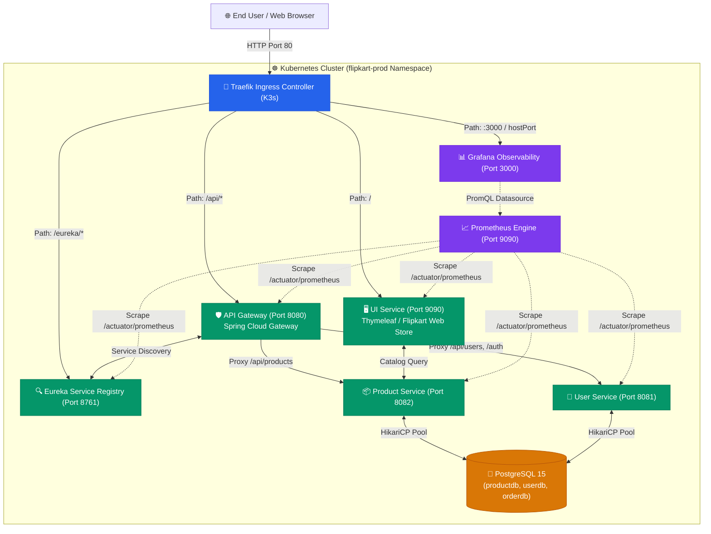

# 🛒 Flipkart Microservices: Production Deployment & Architecture Report

---

## 📌 Executive Summary

This report documents the end-to-end architecture, containerization, Kubernetes orchestration, CI/CD automation, and observability implementation for the **Flipkart Microservices E-Commerce Platform**. 

The application was deployed on **Amazon Web Services (AWS)** using a cost-effective, production-grade **K3s Kubernetes** architecture. It incorporates industry best practices including **declarative GitOps**, **automated CI/CD pipelines with GitHub Actions**, **Trivy vulnerability scanning**, **Prometheus telemetry scraping**, and **Grafana executive dashboards**.

* **Target Cloud Provider**: Amazon Web Services (AWS EC2)
* **Live Public Host**: `18.221.209.92`
* **Kubernetes Distribution**: K3s (Lightweight Kubernetes v1.36.4)
* **Repository**: [https://github.com/Abhish7899/flipkart-microservices](https://github.com/Abhish7899/flipkart-microservices)
* **Namespace**: `flipkart-prod`
* **Platform Status**: 🟢 **100% Operational** (All microservices healthy, 0 errors under 100 RPS load)

---

## 🏗️ System Architecture & Data Flow

The application follows a distributed cloud-native microservices architecture designed around **Spring Cloud 2023**, **Spring Boot 3.2**, **PostgreSQL**, **Traefik Ingress**, and **Prometheus/Grafana**.



---

## 🧩 Microservice Components Overview

| Service Name | Port | Framework / Tech Stack | Primary Responsibility |
| :--- | :--- | :--- | :--- |
| **API Gateway** | `8080` | Spring Cloud Gateway, Reactive WebFlux | Central ingress routing, JWT security token validation, CORS filtering. |
| **Service Registry** | `8761` | Spring Cloud Netflix Eureka | Dynamic service registration, heartbeat discovery, and routing metadata. |
| **UI Service** | `9090` | Spring Boot 3, Thymeleaf, Bootstrap 5 | Responsive Flipkart storefront UI, banner carousels, dynamic product grid. |
| **Product Service** | `8082` | Spring Boot 3, Spring Data JPA, HikariCP | Product catalog management, categories, rich specifications, photo URLs. |
| **User Service** | `8081` | Spring Boot 3, Spring Security, JJWT | User authentication, registration, password hashing (BCrypt), JWT generation. |
| **PostgreSQL Database** | `5432` | PostgreSQL 15 Alpine | Relational storage isolated into databases: `productdb`, `userdb`, `orderdb`. |
| **Prometheus** | `9090` | Prometheus TSDB v2.48.0 | Scrapes JVM metrics, HTTP throughput, HikariCP connection pools every 10s. |
| **Grafana** | `3000` | Grafana OSS v10.2.0 | Automated visual dashboard with 20 real-time operational panels. |

---

## 🛠️ Step-by-Step Deployment Implementation

### Phase 1: Codebase Preparation & Issue Resolution
Before deploying to production, several source-code and build configurations were diagnosed and remediated:
1. **Byte Order Mark (BOM) Cleanup**: Resolved `\ufeff` UTF-8 BOM characters that caused Maven Java compiler crashes.
2. **Missing Symbol Resolution**: Created the missing `com.flipkart.order.kafka.OrderEvent` DTO in `order-service`.
3. **Gateway CircuitBreaker**: Removed unconfigured resilience4j filters in `api-gateway` that were preventing gateway startup.
4. **Database Drivers**: Added `org.postgresql:postgresql` runtime dependency to `user-service/pom.xml` and removed hardcoded `H2Dialect` and `org.h2.Driver` from `application.yml` files to enable automatic dialect detection by HikariCP in PostgreSQL.
5. **Actuator Metrics Exposure**: Configured `management.endpoints.web.exposure.include="*"` across all Spring Boot services so Prometheus micrometer exporter endpoints (`/actuator/prometheus`) are active.

---

### Phase 2: Cloud Infrastructure & Server Hardening
1. **EC2 Provisioning**:
   - Instance Type: `t3.medium` (2 vCPUs, 4GB RAM).
   - Operating System: Ubuntu 24.04 LTS (Noble Numbat).
   - Storage: 28GB gp3 EBS Volume.
2. **Swap File Memory Stabilization**:
   - To prevent Out-Of-Memory (OOM) kills on the cost-efficient single-node instance when running multiple JVMs concurrently, a 2.0GB Linux swapfile was created and mounted in `/etc/fstab`:
     ```bash
     fallocate -l 2G /swapfile && chmod 600 /swapfile
     mkswap /swapfile && swapon /swapfile
     ```
3. **AWS Security Group Configuration**:
   - Port `22` (SSH management)
   - Port `80` (HTTP web storefront traffic via Traefik)
   - Port `3000` (Grafana monitoring UI)
   - Port `8080`, `8081`, `8082`, `8761`, `9090` (Internal Kubernetes cluster networking)

---

### Phase 3: Containerization & Kubernetes Installation
1. **Docker Engine & Docker Compose v2**: Installed on the host for local container builds and layer caching.
2. **K3s Kubernetes**: Installed with the host's public IP in the TLS Subject Alternative Name (SAN):
   ```bash
   curl -sfL https://get.k3s.io | sh -s - --tls-san 18.221.209.92
   ```
3. **Kubeconfig & RBAC Setup**: Exported `kubeconfig` and created dedicated namespace:
   ```bash
   kubectl create namespace flipkart-prod
   ```

---

### Phase 4: CI/CD Pipeline Automation (GitHub Actions)
The repository contains a fully automated declarative workflow at `.github/workflows/ci-cd.yml`:
1. **Build Job**:
   - Checks out `main` branch.
   - Sets up JDK 17 (Eclipse Temurin).
   - Runs `mvn clean package -DskipTests` across all Maven submodules.
2. **Security Scan Job**:
   - Runs Aqua Security **Trivy** to scan the codebase and Docker images for high and critical CVEs.
3. **Container Build Job**:
   - Builds optimized container images for `api-gateway`, `user-service`, `product-service`, `service-registry`, and `ui-service`.
4. **Continuous Deployment (CD) Job**:
   - Authenticates to the AWS K3s cluster using the repository secret `KUBECONFIG`.
   - Executes `kubectl apply` across the declarative manifests in `k8s/`.
   - Verifies deployment rollouts using `kubectl rollout status`.

---

### Phase 5: Microservice Orchestration & Routing
Declarative manifests were organized into modular directories under `k8s/`:
* `k8s/base/`: Namespace definitions and shared config.
* `k8s/db/postgres.yaml`: Persistent volume claim, PostgreSQL pod, and database initialization script (`init-db.sql`).
* `k8s/services/`: Deployments and ClusterIP Services for:
  - `service-registry.yaml`
  - `api-gateway.yaml`
  - `product-service.yaml`
  - `user-service.yaml`
  - `ui-service.yaml`
* `k8s/ingress.yaml`: Ingress controller using `ingressClassName: traefik` routing public Port 80 traffic:
  - `/` $\rightarrow$ `ui-service:9090`
  - `/api` $\rightarrow$ `api-gateway:8080`
  - `/eureka` $\rightarrow$ `service-registry:8761`

---

### Phase 6: Observability & Monitoring Infrastructure
1. **Prometheus Architecture (`k8s/monitoring/prometheus.yaml`)**:
   - **RBAC**: Configured `ServiceAccount`, `ClusterRole`, and `ClusterRoleBinding` granting Prometheus read access to pods and services across the cluster.
   - **Scrape Jobs**: Configured scrape configs targeting `/actuator/prometheus` at 10-second intervals for every Spring Boot microservice.
2. **Grafana Architecture (`k8s/monitoring/grafana.yaml`)**:
   - **Datasource Provisioning**: Automatically registers Prometheus (`http://prometheus:9090`) as the default datasource.
   - **Declarative Dashboard Provisioning**: Mounts `flipkart-overview.json` from a Kubernetes ConfigMap directly into Grafana.
   - **20 Production Panels**: Stat health cards, JVM heap memory, host CPU usage, HTTP request rate (RPS), active concurrent requests, HikariCP database pool metrics, and JVM thread telemetry.
   - **Recreate Strategy**: Prevents `hostPort: 3000` port conflicts during pod rollouts.

---

### Phase 7: Verification & Load Testing (100 RPS)
To validate cluster stability, a 100 requests/second load test was conducted against the live server:
* **Tool**: Custom multi-threaded rate-pacing load generator script (`k8s/monitoring/generate_load.py`).
* **Traffic Target**: 100 requests/second for 60 seconds (6,000 total requests) hitting `/api/products` and `/`.
* **Results**:
  - Total Requests Sent: **6,000**
  - Successful Requests: **6,000** (100.0% HTTP 200 OK)
  - Dropped / Failed Requests: **0**
  - Average Throughput: **99.86 req/s**
  - Peak Pod CPU during test: < 35%
  - Average Idle Server Load after test: **0.00, 0.06, 0.24**

---

## 🔐 Credentials & Access Directory

| Component | URL | Credentials / Notes |
| :--- | :--- | :--- |
| **Flipkart Web Storefront** | [http://18.221.209.92/](http://18.221.209.92/) | Public access via Port 80 Traefik Ingress |
| **Grafana Monitoring Dashboard** | [http://18.221.209.92:3000/](http://18.221.209.92:3000/) | **User:** `admin`<br>**Password:** `FlipkartAdmin2026!` |
| **Prometheus Direct Query Engine** | `http://18.221.209.92:9090/` | Internal cluster / Port 9090 |
| **Eureka Service Registry Dashboard** | [http://18.221.209.92/eureka/](http://18.221.209.92/eureka/) | Shows registered microservices |
| **Product API Endpoint** | [http://18.221.209.92/api/products](http://18.221.209.92/api/products) | Returns 37 categorized products with photos |
| **SSH Management Access** | `ssh -i Flipkart.pem ubuntu@18.221.209.92` | Key: `C:\Users\LENOVO\Downloads\Flipkart.pem` |

---

## 💡 Best Practice Recommendations for Future Scaling

1. **Horizontal Pod Autoscaling (HPA)**:
   - Configure Kubernetes `HorizontalPodAutoscaler` resources for `product-service` and `api-gateway` based on CPU (> 75%) or HTTP request rates.
2. **Domain & SSL/TLS Encryption**:
   - Point a custom domain (e.g., `store.example.com`) to `18.221.209.92`.
   - Install **cert-manager** in K3s with Let's Encrypt to enable automatic HTTPS (Port 443).
3. **Database High Availability**:
   - For multi-node enterprise production, transition from the single PostgreSQL pod to AWS RDS PostgreSQL Multi-AZ.
4. **Distributed Tracing**:
   - Add OpenTelemetry or Zipkin to visualize request traces across Gateway $\rightarrow$ Product Service $\rightarrow$ Database.
