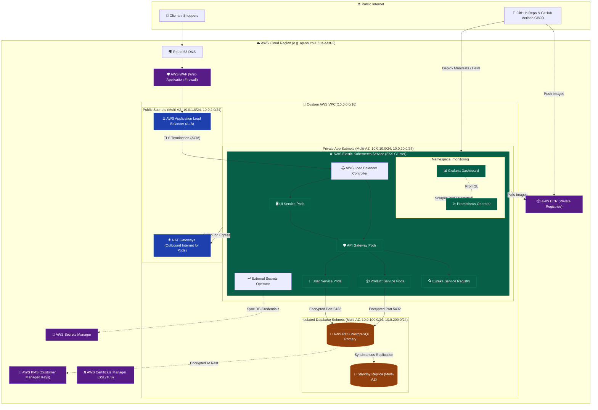

# 🛡️ Enterprise DevOps Engineering Roadmap: Secure Flipkart Microservices on AWS (EKS + ECR + RDS + CI/CD + Monitoring)

---

## 🧭 Executive Introduction

This roadmap is designed for a **DevOps / Platform Engineer** who wants to deploy the **Flipkart Microservices Application** using enterprise-grade cloud patterns on **Amazon Web Services (AWS)**.

Instead of running everything on a single compute node, this guide transitions the architecture into a **production-hardened, defense-in-depth, zero-trust cloud infrastructure** featuring:
* **Infrastructure as Code (IaC)**: Terraform / OpenTofu or `eksctl`
* **Network Isolation**: Multi-AZ AWS VPC with Public, Private, and Isolated Database Subnets
* **Managed Containers (AWS ECR)**: Immutable image tagging and automated vulnerability scanning
* **Kubernetes Orchestration (AWS EKS)**: Managed control plane with worker nodes in private subnets
* **Identity & Security (AWS IAM & IRSA)**: IAM Roles for Service Accounts (no hardcoded credentials)
* **Application Ingress & Edge Protection**: AWS Application Load Balancer (ALB) + AWS WAF + SSL/TLS (ACM)
* **Managed Database (AWS RDS PostgreSQL)**: Multi-AZ automated backups, encryption at rest with AWS KMS
* **CI/CD Automation**: GitHub Actions pipeline with Linting, SAST, Trivy Image Scan, and GitOps / Helm
* **Full-Stack Observability**: Prometheus Operator (kube-prometheus-stack) + Grafana dashboards

---

## 🏛️ Enterprise Secure Cloud Architecture



---

## 🗺️ Step-by-Step Practice Roadmap

```mermaid
flowchart LR
    P1["1. Local Dev\n& Tools Setup"] --> P2["2. VPC & Network\nInfrastructure"]
    P2 --> P3["3. RDS Database\nProvisioning"]
    P3 --> P4["4. ECR Private\nRepositories"]
    P4 --> P5["5. EKS Cluster\nCreation"]
    P5 --> P6["6. AWS Load Balancer\n& TLS Ingress"]
    P6 --> P7["7. External Secrets\n& IAM (IRSA)"]
    P7 --> P8["8. CI/CD Pipeline\nAutomation"]
    P8 --> P9["9. Prometheus\n& Grafana"]
    P9 --> P10["10. Security Audit\n& Cost Cleanup"]
```



---

### Phase 1: Local Tooling & Cloud Prerequisites
Ensure your local workstation has the standard enterprise DevOps toolchain installed:

1. **AWS CLI v2**: Configured with an IAM Administrator user.
   ```bash
   aws configure
   aws sts get-caller-identity
   ```
2. **Terraform** ($\ge$ 1.6) or **OpenTofu**: For provisioning cloud resources.
3. **kubectl** ($\ge$ 1.28): For Kubernetes cluster administration.
4. **eksctl** ($\ge$ 0.170): For rapid, standard EKS cluster provisioning.
5. **Helm 3**: For package management (Ingress, Prometheus, External Secrets).

---

### Phase 2: Secure Multi-AZ VPC Architecture

> [!IMPORTANT]
> Never deploy production Kubernetes worker nodes or databases into public subnets. Worker nodes and databases must always reside in private subnets with no direct route to the Internet.

#### Subnet Allocation Strategy (`10.0.0.0/16`)
* **Public Subnets** (`10.0.1.0/24`, `10.0.2.0/24`): Internet Gateway, ALBs, and NAT Gateways.
  - Tag: `kubernetes.io/role/elb = 1` (Allows AWS ALB Controller to discover public subnets).
* **Private App Subnets** (`10.0.10.0/24`, `10.0.20.0/24`): EKS Worker Nodes and Pods.
  - Tag: `kubernetes.io/role/internal-elb = 1` (Allows internal load balancing).
  - Outbound traffic routes via NAT Gateway.
* **Isolated Database Subnets** (`10.0.100.0/24`, `10.0.200.0/24`): AWS RDS PostgreSQL instances.
  - No Internet Gateway, no NAT Gateway route. Completely isolated from the public internet.

---

### Phase 3: AWS RDS PostgreSQL Deployment

1. **DB Subnet Group**: Attach the two isolated database subnets across Multi-AZ.
2. **Security Group Rules**:
   - Inbound: Allow TCP port `5432` **only** from the EKS Node Security Group. Deny all other traffic.
3. **KMS Encryption**: Enable storage encryption using the AWS-managed key `aws/rds` or a Customer Managed Key (CMK).
4. **Parameter Group**:
   - Force SSL: `rds.force_ssl = 1` (Ensures in-transit TLS encryption from Spring Boot microservices).

```bash
# Example AWS CLI command to create DB Subnet Group
aws rds create-db-subnet-group \
  --db-subnet-group-name flipkart-db-subnet-group \
  --db-subnet-group-description "Isolated subnets for Flipkart RDS" \
  --subnet-ids "subnet-private-db-az1" "subnet-private-db-az2"
```

---

### Phase 4: AWS ECR (Elastic Container Registry)

Create private ECR repositories with **KMS encryption** and **Image Scanning on Push**:

```bash
SERVICES=("api-gateway" "product-service" "user-service" "service-registry" "ui-service")

for svc in "${SERVICES[@]}"; do
  aws ecr create-repository \
    --repository-name flipkart/${svc} \
    --image-tag-mutability IMMUTABLE \
    --image-scanning-configuration scanOnPush=true \
    --encryption-configuration encryptionType=KMS
done
```

> [!TIP]
> Setting `--image-tag-mutability IMMUTABLE` guarantees that once an image tag (e.g., git commit SHA `a07521a`) is pushed, it can never be overwritten, preventing malicious or accidental image tampering.

---

### Phase 5: EKS Cluster Deployment (via `eksctl` or Terraform)

Use `eksctl` with a declarative cluster config file (`eks-cluster.yaml`):

```yaml
apiVersion: eksctl.io/v1alpha5
kind: ClusterConfig

metadata:
  name: flipkart-prod-eks
  region: us-east-2
  version: "1.30"

vpc:
  subnets:
    private:
      us-east-2a: { id: "subnet-private-app-az1" }
      us-east-2b: { id: "subnet-private-app-az2" }
    public:
      us-east-2a: { id: "subnet-public-az1" }
      us-east-2b: { id: "subnet-public-az2" }

iam:
  withOIDC: true # Enables IAM Roles for Service Accounts (IRSA)

managedNodeGroups:
  - name: flipkart-managed-ng
    instanceType: t3.medium
    minSize: 2
    maxSize: 4
    desiredCapacity: 2
    privateNetworking: true # Nodes are strictly in private subnets
    volumeSize: 30
    volumeEncrypted: true
    labels: { role: worker }
    tags:
      Environment: Production
      Project: Flipkart
```

Create the cluster:
```bash
eksctl create cluster -f eks-cluster.yaml
```

---

### Phase 6: Application Ingress & SSL Termination (AWS ALB Controller)

Instead of using basic Traefik or NodePort, use the **AWS Load Balancer Controller** to provision native AWS ALBs managed by Kubernetes `Ingress` resources:

1. **Install AWS Load Balancer Controller**:
   ```bash
   helm repo add eks https://aws.github.io/eks-charts
   helm repo update
   helm install aws-load-balancer-controller eks/aws-load-balancer-controller \
     -n kube-system \
     --set clusterName=flipkart-prod-eks \
     --set serviceAccount.create=true \
     --set serviceAccount.name=aws-load-balancer-controller
   ```
2. **Kubernetes Ingress Manifest with HTTPS & WAF**:
   ```yaml
   apiVersion: networking.k8s.io/v1
   kind: Ingress
   metadata:
     name: flipkart-alb-ingress
     namespace: flipkart-prod
     annotations:
       kubernetes.io/ingress.class: alb
       alb.ingress.kubernetes.io/scheme: internet-facing
       alb.ingress.kubernetes.io/target-type: ip
       alb.ingress.kubernetes.io/certificate-arn: arn:aws:acm:region:account:certificate/xxx
       alb.ingress.kubernetes.io/listen-ports: '[{"HTTP": 80}, {"HTTPS": 443}]'
       alb.ingress.kubernetes.io/ssl-redirect: '443'
       alb.ingress.kubernetes.io/wafv2-acl-arn: arn:aws:wafv2:region:account:regional/webacl/flipkart-waf/xxx
   spec:
     rules:
       - http:
           paths:
             - path: /api
               pathType: Prefix
               backend:
                 service:
                   name: api-gateway
                   port:
                     number: 8080
             - path: /
               pathType: Prefix
               backend:
                 service:
                   name: ui-service
                   port:
                     number: 9090
   ```

---

### Phase 7: Zero-Trust Secrets Management (IRSA + External Secrets Operator)

> [!CAUTION]
> Never store raw passwords or database secrets in plain text inside Kubernetes ConfigMaps or Git repositories.

1. **Store Database Secrets in AWS Secrets Manager**:
   ```bash
   aws secretsmanager create-secret \
     --name "flipkart/prod/postgres" \
     --secret-string '{"username":"postgres","password":"YourSuperSecurePassword2026!","dbname":"productdb"}'
   ```
2. **Install External Secrets Operator (ESO)**:
   Synchronizes secrets from AWS Secrets Manager directly into native Kubernetes Secrets in memory.
3. **Configure IAM Role for Service Account (IRSA)**:
   Attach `secretsmanager:GetSecretValue` permission to the pod's ServiceAccount using OpenID Connect (OIDC).

---

### Phase 8: GitHub Actions CI/CD Pipeline Automation

Create a production pipeline (`.github/workflows/deploy-eks.yml`) that includes:
1. **Trigger**: Push to `main` or Git Tag.
2. **Static Application Security Testing (SAST)**:
   - Checkstyle / SonarCloud scan.
3. **Maven Build & Artifact Creation**:
   - `mvn clean package -DskipTests`
4. **Vulnerability Container Scan (Aqua Trivy)**:
   - Fails pipeline if any `CRITICAL` CVE is detected.
5. **Push to Amazon ECR**:
   - Tagged with git commit hash (`${{ github.sha }}`).
6. **Continuous Deployment (CD) to EKS**:
   - Assumes AWS IAM Role via GitHub OIDC (No long-lived AWS Access Keys!).
   - Runs `helm upgrade --install` or `kubectl set image`.

---

### Phase 9: Enterprise Monitoring & Observability

Install the **Kube-Prometheus-Stack** (Prometheus Operator + Grafana):

```bash
helm repo add prometheus-community https://prometheus-community.github.io/helm-charts
helm repo update

helm install monitoring prometheus-community/kube-prometheus-stack \
  --namespace monitoring \
  --create-namespace \
  --set grafana.adminPassword="FlipkartSecureAdmin2026!" \
  --set prometheus.prometheusSpec.serviceMonitorSelectorNilUsesHelmValues=false
```

Deploy a `ServiceMonitor` so Prometheus automatically detects Spring Boot `/actuator/prometheus` endpoints on all microservices pods!

---

### Phase 10: DevSecOps Practice Checklist & Cost Management

For practicing without incurring unnecessary cloud costs:

| Resource | Production Best Practice | Practice / Learning Budget Alternative |
| :--- | :--- | :--- |
| **AWS EKS Control Plane** | Always On ($0.10/hr = ~$73/mo) | Create cluster when practicing; delete when finished (`eksctl delete cluster`). |
| **Worker Nodes** | 3x `m5.large` across 3 AZs | 2x `t3.medium` or `t3a.medium` in 2 AZs. |
| **AWS RDS** | Multi-AZ `db.m6g.large` ($150+/mo) | Single-AZ `db.t4g.micro` or `db.t3.micro` (AWS Free Tier eligible). |
| **NAT Gateway** | 2-3 NAT Gateways ($32/mo each) | 1 NAT Gateway for practice, or use an EC2 NAT instance ($3/mo). |
| **WAF** | Managed Rule Sets ($5/mo + traffic) | Enable during testing, detach when idle. |

---

## 🚀 Recommended Practice Sequence

1. **Day 1**: Fork the repository and build the Docker images locally. Run `mvn clean package` and `docker compose up` to understand all microservice connections.
2. **Day 2**: Use Terraform or AWS CLI to create the Custom VPC (Public, Private App, Isolated DB subnets) and 1 NAT Gateway.
3. **Day 3**: Launch an RDS PostgreSQL `db.t3.micro` instance in the isolated subnets and initialize the `productdb`, `userdb`, and `orderdb`.
4. **Day 4**: Create the EKS cluster using `eksctl` with private nodes. Connect your local `kubectl`.
5. **Day 5**: Deploy the AWS Load Balancer Controller and expose the microservices via Ingress.
6. **Day 6**: Setup GitHub Actions CI/CD with ECR and OIDC deployment.
7. **Day 7**: Install Kube-Prometheus-Stack and import your Flipkart Microservices Grafana Dashboard!
