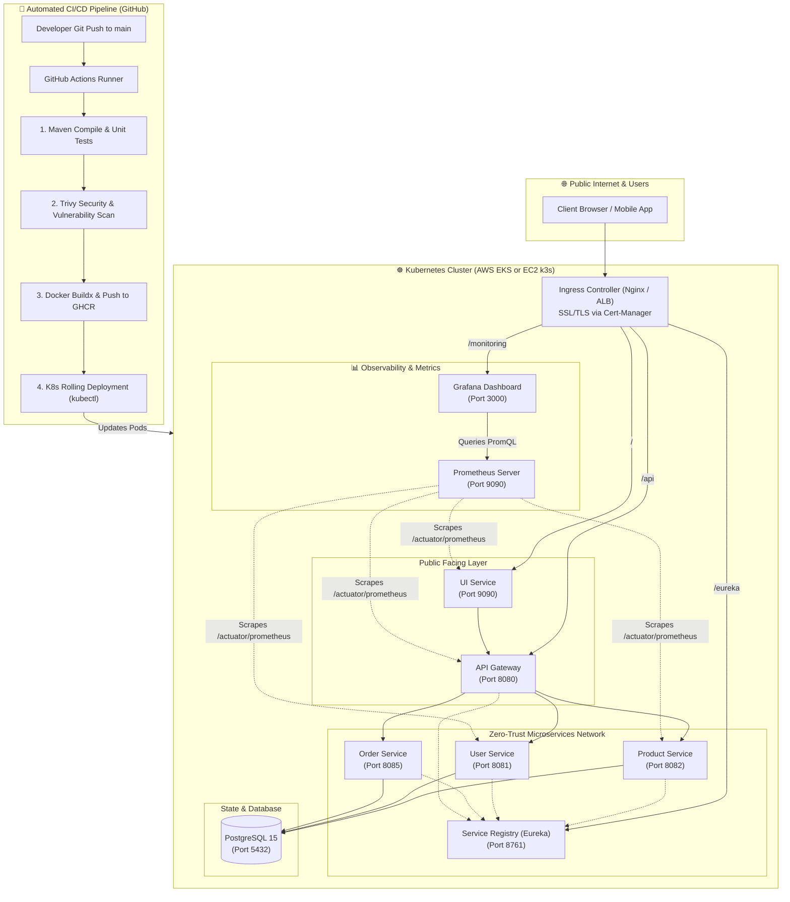

# 🏛️ Enterprise Flipkart Microservices — Small Production Architecture

> **Complete guide for deploying a secure, observable, production-grade microservices system on a budget using Kubernetes (K8s), CI/CD (GitHub Actions), Prometheus & Grafana Monitoring, and HTTPS Security.**

---

## 1. 🏗️ High-Level System Architecture



---

## 2. 🔐 Security & Hardening (Company Production Standards)

| Security Aspect | Implementation |
|---|---|
| **Zero-Trust Networking** | `k8s/network-policy.yaml` blocks public access to backend microservices and databases. Only the Ingress controller can talk to UI and Gateway. |
| **Secret Management** | `k8s/secrets.yaml` separates database passwords, JWT signing keys, and cloud credentials from configuration and code. |
| **TLS/HTTPS Automation** | `cert-manager` automatically requests and renews 90-day Let's Encrypt certificates without human intervention. |
| **Container Hardening** | Multi-stage Docker builds running unprivileged Alpine JRE base images (`eclipse-temurin:17-jre-alpine`). |
| **CI/CD Vulnerability Scanning** | Aqua Security Trivy scans filesystem and dependencies in GitHub Actions for `CRITICAL` and `HIGH` CVEs on every push. |
| **Health Probes** | `livenessProbe` and `readinessProbe` prevent broken pods from receiving traffic before they are healthy. |

---

## 3. 📊 Monitoring & Observability Stack

- **Metrics Collection (`Prometheus`)**:
  - Automatically scrapes `/actuator/prometheus` across all Spring Boot microservices every 15 seconds.
  - Monitors JVM Heap (`jvm_memory_used_bytes`), Garbage Collection pauses (`jvm_gc_pause_seconds_count`), CPU utilization, and HTTP request latencies (`http_server_requests_seconds_count`).
- **Metrics Visualization (`Grafana`)**:
  - Accessible via `http://<your-cluster-ip>/monitoring` or Port 3000.
  - Default credentials: User: `admin` | Password: `FlipkartAdmin2026!`
  - Pre-configured with automatic Prometheus datasource (`k8s/monitoring/grafana.yaml`).

---

## 4. 💰 Cost-Optimized "Small Production" AWS Strategy

| Architecture Option | Monthly Cost | Ideal For | Recommendation |
|---|---|---|---|
| **K3s / Lightweight K8s on EC2 (`t3.medium` or `t3.large`)** | **~\$15 - \$30 / month** | **Learning, Portfolios, Startups, Demos** | ⭐ **Top Recommendation** — Gives you 100% genuine Kubernetes (`kubectl`, Ingress, Namespaces, Helm) at 80% lower cost than managed EKS. |
| **Amazon EKS Managed Cluster** | ~\$73/mo (control plane) + \$35/mo (nodes) = **~\$110 / month** | Large Enterprises | Overkill for a personal learning/small production project. |

### How to set up K3s on a single EC2 Ubuntu instance:
```bash
# 1. SSH into your Ubuntu EC2 instance
ssh -i your-key.pem ubuntu@<EC2-IP>

# 2. Install lightweight K8s (k3s) in one command:
curl -sfL https://get.k3s.io | sh -

# 3. Verify nodes are Ready:
sudo kubectl get nodes
```

---

## 5. 🚀 Deploying to Kubernetes

Once your cluster is running, deploy the full stack with one command:

```bash
# 1. Create Namespace
kubectl apply -f k8s/namespace.yaml

# 2. Apply Secrets and ConfigMap
kubectl apply -f k8s/secrets.yaml
kubectl apply -f k8s/configmap.yaml

# 3. Apply Zero-Trust Network Policies
kubectl apply -f k8s/network-policy.yaml

# 4. Deploy Services and Microservices
kubectl apply -f k8s/services/
kubectl apply -f k8s/deployments/

# 5. Deploy Prometheus and Grafana Monitoring
kubectl apply -f k8s/monitoring/

# 6. Apply Ingress Routing
kubectl apply -f k8s/ingress.yaml

# 7. Check rollout status
kubectl get pods -n flipkart-prod -w
```
